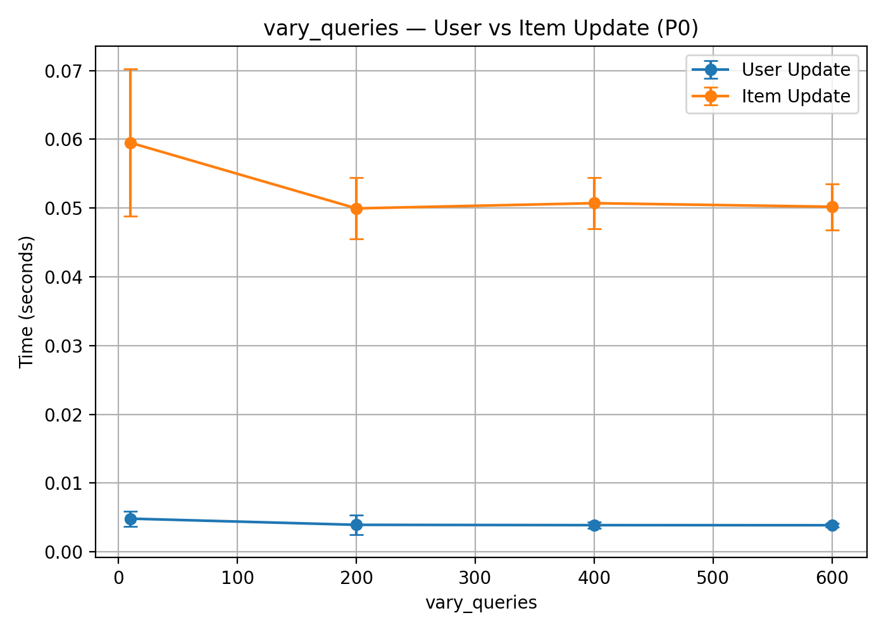
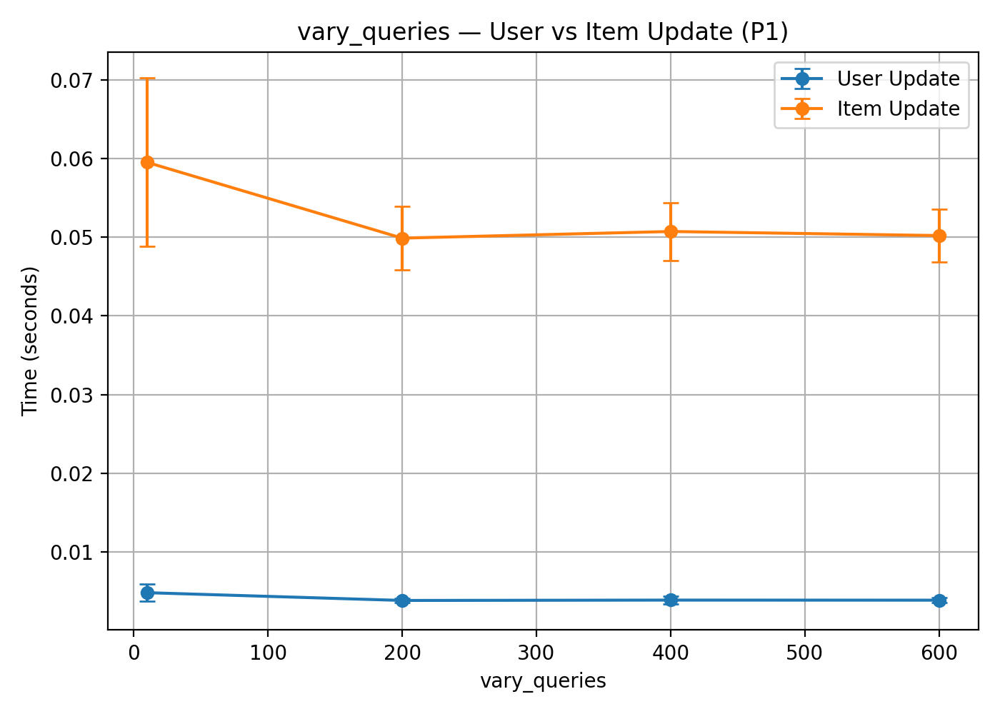
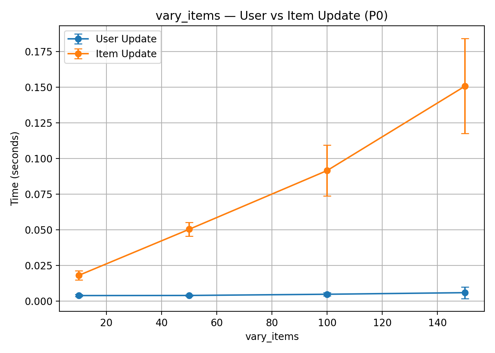
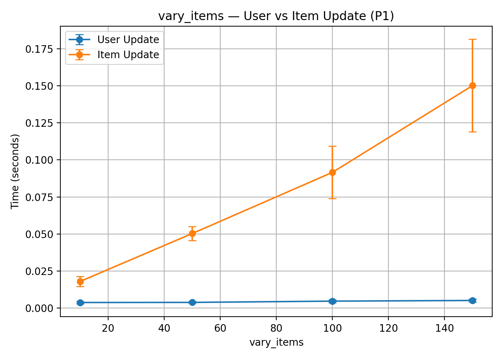
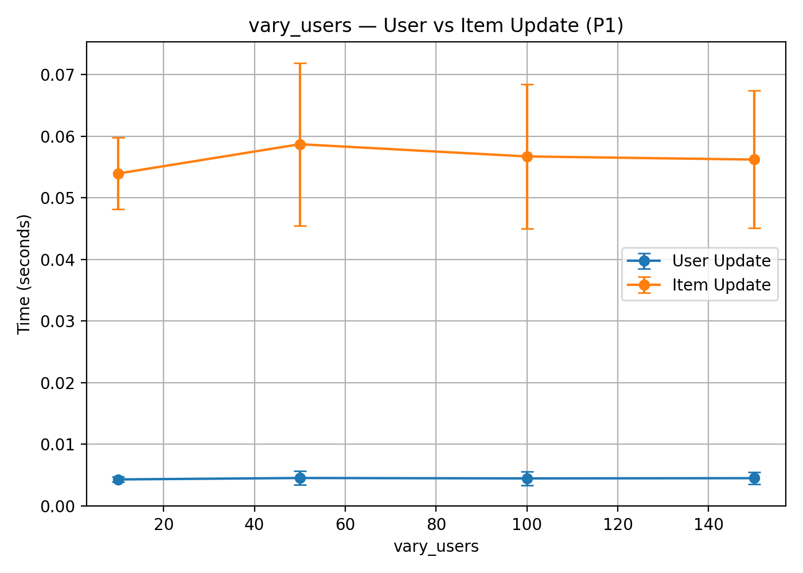
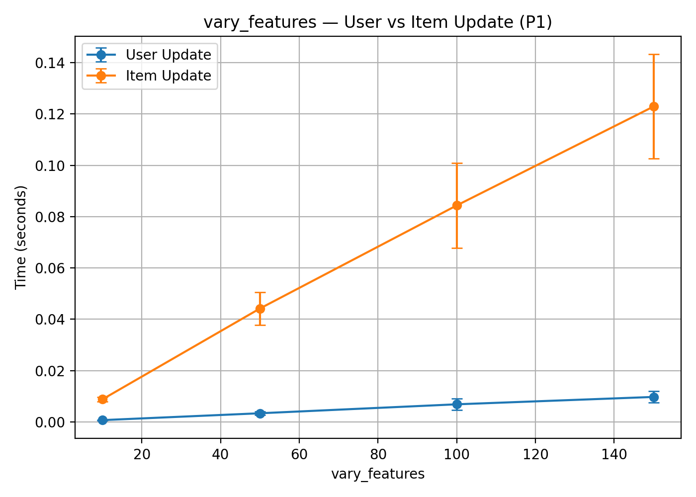

# **Assignment 4 — Plots for Secure Updates on User Matrix (Public Index) and Item Matrix (Private Index)**

| **Name**     | **Roll Number** | **Email**                                                 |
| ------------ | --------------- | --------------------------------------------------------- |
| Mahaarajan J | 220600          | [mahaarajan22@iitk.ac.in](mailto:mahaarajan22@iitk.ac.in) |

---

This assignment implements secure updates to the user matrix $U$ and item matrix $V$ using:

* Distributed Point Functions over $\mathbb{F}_{2^{13}-1}$
* Additive shares across two parties (P0 and P1)
* MPC-based secure multiplications
* Full micro-timing instrumentation

The protocol computes updates of the form:

$$
U[i] \leftarrow U[i] + V[j]\cdot\Delta,
\qquad
V[j] \leftarrow V[j] + U[i]\cdot\Delta
$$

where the user index $i$ is public and the item index $j$ is encoded using a DPF.

---

## **1. Directory Structure (Analysis)**

```
analysis_plots_saved/
    vary_features_P0_combined.png
    vary_features_P1_combined.png
    vary_items_P0_combined.png
    vary_items_P1_combined.png
    vary_queries_P0_combined.png
    vary_queries_P1_combined.png
    vary_users_P0_combined.png
    vary_users_P1_combined.png

data_collect.py
data_plot.py

```

Plots may be embedded using:

```md

```

---

## **2. data_collect.py — Summary Extraction**

This script aggregates raw micro-timing CSVs produced by the protocol.

### **Functionality**

* Traverses experiment folders such as:

  * `vary_queries/`
  * `vary_items/`
  * `vary_users/`
  * `vary_features/`
* Loads all micro-time files:

  * `times_role*_t_delta.txt`
  * `times_role*_t_vjdelta.txt`
  * `times_role*_t_Uwrite.txt`
  * `times_role*_t_uidelta.txt`
  * `times_role*_t_Vwrite.txt`
  * `preprocess_times.txt`
  * `online_times.txt`
* Computes aggregated totals:
  $$
  T_X = \sum_q t_X(q)
  $$
* Writes summary CSVs:

  * `vary_queries_summary.csv`
  * `vary_items_summary.csv`
  * `vary_users_summary.csv`
  * `vary_features_summary.csv`

### **Associated Plots**

The summary CSVs processed by this script are visualized in the following combined plots:

#### **Queries varying**

* P0:
  
* P1:
  

* As we can observe the time for updates in each query remains almost constant with the time for item updates far greater than user updates as j is kept private

#### **Items varying**

* P0:
  
* P1:
  

* As we can observe the time for updates in each query increases for item updates as we have increased the number of items, however the user updates are more or less constant
#### **Users varying**

* P0:
  
* P1:
  

* As we can observe the time for updates in each query remains almost constant as item updates are independent of this and in user updates as we are aware of i the number of users does not matter

#### **Features varying**

* P0:
  
* P1:
  

* Both increase with increase in number of features due to more dimensions to deal with hence more computations are involved

---

## **3. data_plot.py — Plot Generation**

This script reads the summary CSVs and renders the visualizations shown above.

### **Functionality**

* Loads each `*_summary.csv`
* Extracts:

  * preprocessing time
  * online time
  * micro-timing components (Δ, vj, Uwrite, ui, Vwrite)
* Produces *combined* stacked plots for each party (P0 & P1)
* Saves results to:

```
analysis_plots/
```

These are exactly the eight files referenced above.

### **Usage**

```
python data_plot.py
```

The script regenerates all figures in `analysis_plots/`.

---

## **4. Notes**

* All times are stored in microseconds.
* Time for computation of delta and shares of vj are included in the time for updates of both item and user profiles
* Preprocessing is recorded once per run.
* Online timing is summed across queries.
* Plots depend directly on the summary CSVs created by `data_collect.py <num_repeats>`
* Pandas, matplotlib and numpy must be installed in the system for plots to be generated

## **Declaration**

I hereby declare that this assignment is my individual and original work.
The implementation is original, built using C++ and Python, and adheres to the IIT Kanpur Academic Integrity Policy.
All code can be explained during evaluation.